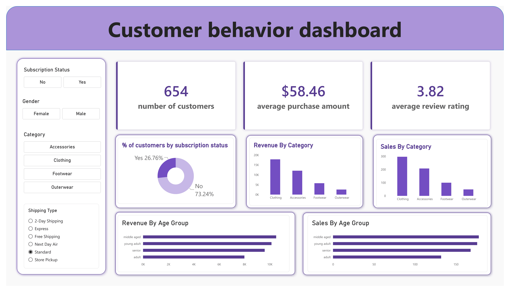

# 🛍️ Customer Shopping Behavior Analysis

### 🛠️ Tools Used
**Python** • **Pandas** • **PostgreSQL** • **SQL** • **Power BI** • **GitHub**

## 📂 Project Files

- 🐍 [Python Code](python%20code.ipynb)
- 🗄️ [SQL Queries](SQL%20Queries)
- 📊 [Power BI Dashboard](Dashboard.pbix)
- 📄 [Project Overview](Project%20Overview.pdf)
- 📁 [Dataset](CSV%20File)
---
## 📑 Table of Contents

1. [Executive Summary](#1-executive-summary)
2. [Business Problem](#2-business-problem)
3. [Methodology](#3-methodology)
   - [Python — Data Cleaning & Feature Engineering](#-python--data-cleaning--feature-engineering)
   - [SQL — Business Analysis](#-sql--business-analysis)
   - [Power BI — Data Visualization](#-power-bi--data-visualization)
4. [Business Recommendations](#4-business-recommendations)
5. [Next Steps](#5-next-steps)

---

---

## 1. Executive Summary

This project analyzes customer shopping behavior using a dataset containing **3,900 purchase transactions and 18 features**.

The objective is to transform raw customer data into actionable business insights that can help a retail company improve **sales, customer engagement, customer satisfaction, and long-term loyalty**.

The project follows an end-to-end data analytics workflow:

**Python → PostgreSQL → SQL Analysis → Power BI → Business Recommendations**

The analysis focuses on customer demographics, purchasing behavior, product categories, customer reviews, discounts, subscription status, shipping preferences, customer loyalty, and revenue contribution.

---

## 2. Business Problem

A leading retail company wants to better understand its customers' shopping behavior in order to improve sales, customer satisfaction, and long-term loyalty.

Management has noticed changes in purchasing patterns across different demographics, product categories, and customer behaviors. The company is particularly interested in understanding factors such as **discounts, product reviews, purchase frequency, subscription status, and shipping preferences**.

### Business Question

> **How can the company leverage consumer shopping data to identify trends, improve customer engagement, and optimize marketing and product strategies?**

### Key Business Questions

- Which gender generates more revenue?
- Which customers use discounts but still spend above average?
- Which products receive the highest customer ratings?
- Do Express shipping customers spend more than Standard shipping customers?
- Do subscribers generate more revenue than non-subscribers?
- Which products are most dependent on discounts?
- How are customers distributed across New, Returning, and Loyal segments?
- What are the top 3 most purchased products within each category?
- Are customers with more than 5 purchases more likely to subscribe?
- Which age groups contribute the most revenue?

---

## 3. Methodology

### 🐍 Python — Data Cleaning & Feature Engineering

Python and Pandas were used to clean the dataset and create new features for customer behavior analysis.

**1. Missing Value Imputation**

Handled 37 missing values in the `Review Rating` column using the median rating of each product category.

```python
df['Review Rating'] = df.groupby('Category')['Review Rating'].transform(
    lambda x: x.fillna(x.median())
)
```

**2. Age Group Creation**

Used quantile-based binning (`pd.qcut`) to divide customers into four age groups for demographic analysis.

```python
labels = ['young adult', 'adult', 'middle aged', 'senior']

df['age_group'] = pd.qcut(
    df['age'],
    q=4,
    labels=labels
)
```

**3. Purchase Frequency Transformation**

Converted categorical purchase frequencies into numerical days to make purchasing behavior easier to analyze.

```python
frequency_mapping = {
    'Fortnightly': 14,
    'Weekly': 7,
    'Monthly': 30,
    'Quarterly': 90,
    'Bi-Weekly': 14,
    'Annually': 365,
    'Every 3 Months': 90
}

df['purchase_frequency_days'] = df['frequency_of_purchases'].map(
    frequency_mapping
)
```

---

### 🗄️ SQL — Business Analysis

PostgreSQL was used to answer business questions and identify customer purchasing patterns through SQL queries.

**1. Revenue Analysis by Gender**

Calculated total revenue generated by male and female customers using aggregation.

```sql
SELECT 
    gender,
    SUM(purchase_amount) AS revenue
FROM customer
GROUP BY gender;
```

**2. Customer Segmentation Using CASE**

Segmented customers into New, Returning, and Loyal groups based on their previous purchases.

```sql
WITH customer_type AS (
    SELECT 
        customer_id,
        previous_purchases,
        CASE 
            WHEN previous_purchases = 1 THEN 'New'
            WHEN previous_purchases BETWEEN 2 AND 10 THEN 'Returning'
            ELSE 'Loyal'
        END AS customer_segment
    FROM customer
)

SELECT 
    customer_segment,
    COUNT(*) AS total_customers
FROM customer_type
GROUP BY customer_segment;
```

**3. Top 3 Products Within Each Category Using ROW_NUMBER()**

Identified the three most purchased products within each category using window functions.

```sql
WITH item_counts AS (
    SELECT 
        category,
        item_purchased,
        COUNT(customer_id) AS total_orders,
        ROW_NUMBER() OVER (
            PARTITION BY category 
            ORDER BY COUNT(customer_id) DESC
        ) AS item_rank
    FROM customer
    GROUP BY category, item_purchased
)

SELECT 
    item_rank,
    category,
    item_purchased,
    total_orders
FROM item_counts
WHERE item_rank <= 3;
```

**4. Discount Analysis Using Subqueries**

Identified customers who used discounts but still spent above the average purchase amount.

```sql
SELECT 
    customer_id,
    purchase_amount
FROM customer
WHERE discount_applied = 'Yes'
AND purchase_amount >= (
    SELECT AVG(purchase_amount)
    FROM customer
);
```

---

### 📊 Power BI — Data Visualization

Developed an interactive Power BI dashboard to visualize customer purchasing behavior and support business decision-making.

**Dashboard Preview**

[](Dashboard.pbix)

**Key Dashboard Features:**

* KPI overview: Number of Customers, Average Purchase Amount, and Average Review Rating.
* Revenue and sales breakdown by product category.
* Customer subscription status analysis.
* Revenue and sales distribution by age group.
* Interactive filters for Subscription Status, Gender, Category, and Shipping Type.

The dashboard includes:

- **Number of Customers** KPI
- **Average Purchase Amount** KPI
- **Average Review Rating** KPI
- Customer subscription status
- Sales by product category
- Revenue by product category
- Sales by age group
- Revenue by age group
- Subscription status analysis

Interactive filters allow users to explore the data by:

- Subscription Status
- Gender
- Category
- Shipping Type

## 4. Business Recommendations

### 👥 Customer Loyalty

Customers were segmented into **New, Returning, and Loyal** groups based on their purchase history.

**Recommendation:**

Develop loyalty programs that reward repeat customers and encourage Returning customers to become Loyal customers through points, exclusive rewards, and repeat-purchase incentives.

### ⭐ Subscription Strategy

The dashboard provides a breakdown of customers based on their subscription status, allowing the company to compare subscriber and non-subscriber behavior.

The SQL analysis also examines whether customers with more than five purchases are more likely to subscribe.

**Recommendation:**

Introduce exclusive subscriber benefits such as member-only discounts, loyalty rewards, and shipping benefits to encourage high-value customers to subscribe.

### 🏷️ Discount Strategy

The analysis identifies products with a high percentage of discounted purchases and examines customers who use discounts while still spending above the average purchase amount.

**Recommendation:**

Review the discount strategy for highly discount-dependent products to ensure promotions increase sales without unnecessarily reducing profit margins.

### 🛍️ Product & Category Performance

Sales and revenue were analyzed across different product categories through the Power BI dashboard.

Top-rated and most frequently purchased products were also identified through SQL analysis.

**Recommendation:**

Feature high-performing and highly rated products more prominently in marketing campaigns, product recommendations, and promotional activities.

### 🎯 Customer Demographics

The dashboard provides both **sales and revenue analysis by age group**, helping identify differences in purchasing behavior and revenue contribution across customer segments.

**Recommendation:**

Focus marketing efforts on high-revenue age groups and tailor campaigns according to their purchasing behavior and preferences.

### 🚚 Shipping Preferences

Shipping type was analyzed using SQL and incorporated as an interactive dashboard filter.

**Recommendation:**

Use shipping preferences as an additional customer segmentation factor and consider premium shipping benefits as part of subscription or loyalty programs.

---

## 5. Next Steps

### 🤖 Predictive Analytics

Future versions of the project could incorporate machine learning models to predict:

- Customer churn
- Subscription likelihood
- Future purchasing behavior
- Customer lifetime value

### 🎯 Personalized Product Recommendations

A recommendation system could be developed to suggest products based on:

- Previous purchases
- Product categories
- Purchase frequency
- Customer preferences


